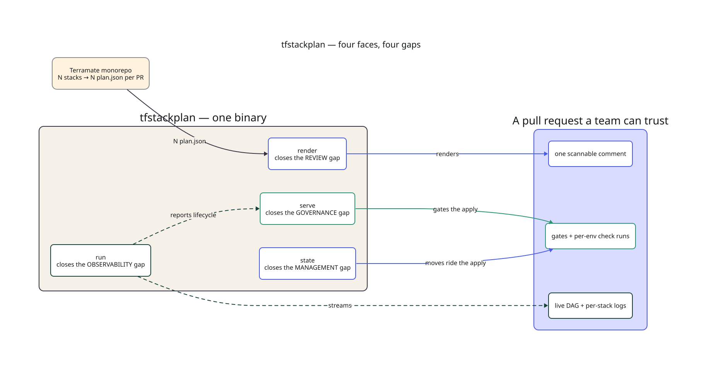
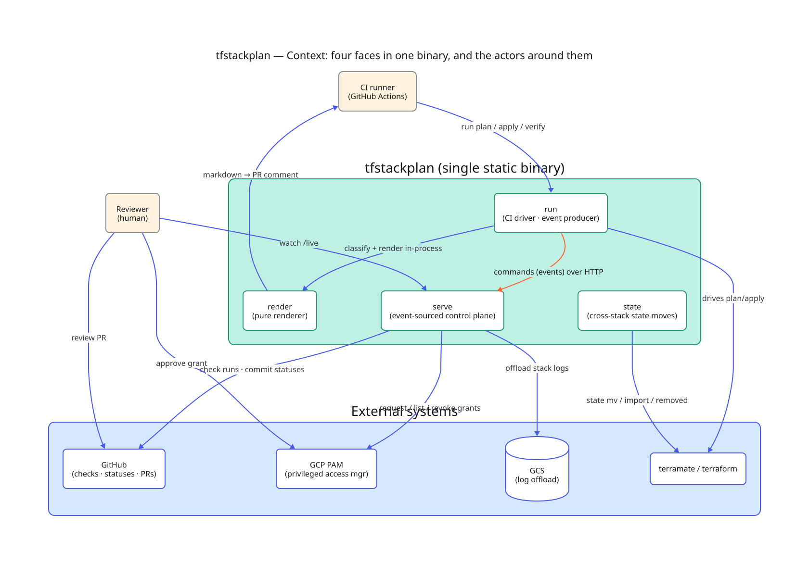
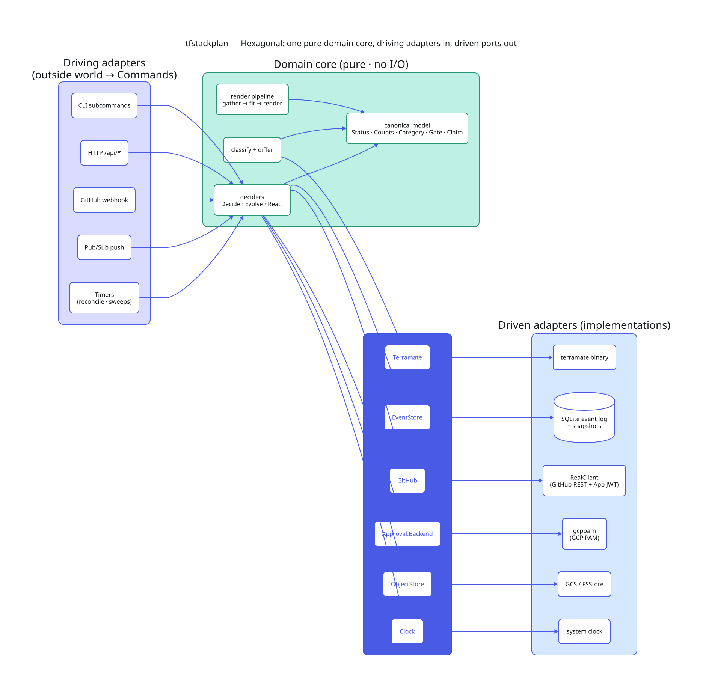
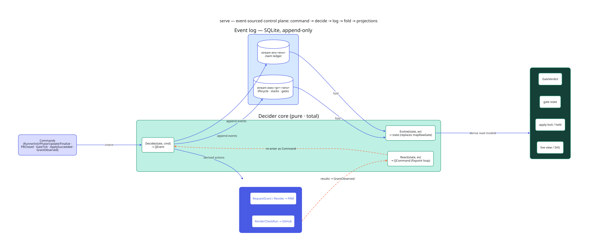
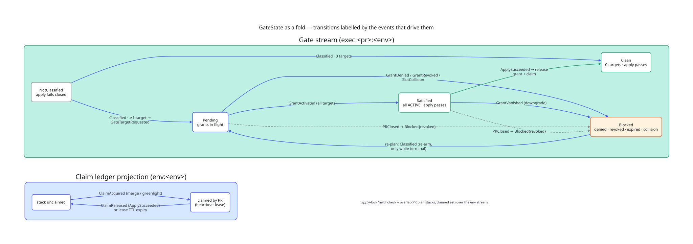
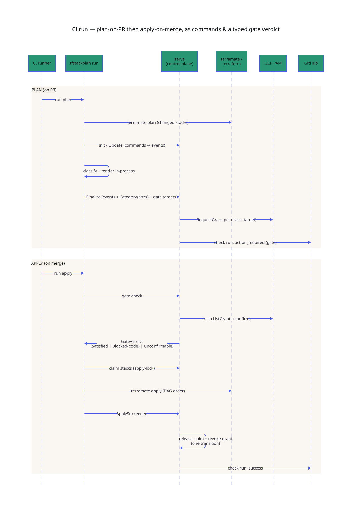

# Architecture diagrams

These six D2 views describe the architecture of `tfstackplan` — an
event-sourced control plane that unifies its four faces
(`render` / `run` / `serve` / `state`) around one canonical domain model and a
single decider core (`Decide` / `Evolve` / `React`). This is the shape the code
has now, not a target: the redesign has landed. The living implementation doc is
[`../DESIGN.md`](../DESIGN.md); the guide's [mental model](../guide/02-mental-model.md)
is the gentler introduction.

Each diagram is checked in as `.d2` source + rendered `.svg`. Regenerate with
`d2 <name>.d2 <name>.svg` (Fluent Health theme conventions applied).

| # | View | Question it answers |
|---|------|---------------------|
| 00 | [Four faces, four gaps](00-four-faces.svg) | The one-idea overview: each face closes one gap, monorepo → trustworthy PR. |
| 01 | [Context](01-context.svg) | The four faces in one binary, and the actors around them. |
| 02 | [Hexagon](02-hexagon.svg) | One pure domain core; driving adapters in, driven ports out. |
| 03 | [Control plane](03-control-plane.svg) | `command → decide → log → fold → projections`, over two stream scopes. |
| 04 | [Gate lifecycle](04-gate-lifecycle.svg) | `GateState` as a fold; transitions labelled by the events that drive them. |
| 05 | [CI run sequence](05-ci-run-sequence.svg) | Plan-on-PR / apply-on-merge as commands and a typed gate verdict. |

## Four faces, four gaps

## Context

## Hexagon — ports & adapters

## Event-sourced control plane

## Gate lifecycle as a fold

## CI run sequence

